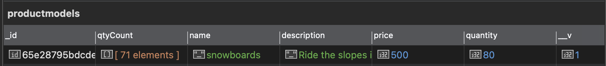

# Shopping Cart
 
This is a simple Shopping Cart website modeled after a ski resort shop. This is made with the following technologies:
- BootStrap
- Node.js
- Express
- Handlebars (for view templates)
- MongoDB (NoSQL database)
- ​Passport.js (for authentication)
- bcrypt (for securely storing the user passwords)

---

## Initial Instructions:

#### Required Setup and Installs (MAC)
1. Make sure you install NodeJS and MongoDB.

2. On my local machine, I have the following installed:
    - [NodeJS v18.19.0](https://nodejs.org/en/download)
    - [MongoDB Community Edition v7.0.2](https://www.mongodb.com/try/download/community) 
    - **Optional:** I am using [Studio3T](https://studio3t.com/download/) as my MongoDB GUI.

3. Start your MongoDB instance
    - Run ```brew services start mongodb-community```
    - Run ```mongosh```

4. In your MongoDB GUI or CLI, please create the following:
    - Create a new database called ```shopping_cart```
    - Create a user the below user with said permissions to this database.
      - User: ```user``` 
      - Password: ```secret```
      - Permissions: ```read/write permissions``` 


#### Project Install
1. Open this root folder in your CLI, and and run ```​npm install``` ​to install the node packages.

2. Run ```node populate_database.js``` to populate the database.

3. Run ```node server.js``` to start the project.

4. Go to ```http://localhost:3000``` in your web browser.

----

## Walkthrough

#### 1. Create Your Account
- First, create an account by clicking ```Sign Up``` at the left of navbar.
- 

- Now you will see a new user form. Fill out the form to create your account. (Password requires a min of 6 characters).  I am using two external libraries:
    - Passport.js (for authentication)
    - bcrypt (for securely storing the user passwords)
- 

- You can verify and confirm in the database that your user account has been created. (```usermodels``` collection).
- 

- After creating your account, you will be redirected to the home page. You will notice that the navbar have changed: 
  - At the right of the navbar, you will see ```Hi, (your first name)```. If you close out this website, or tab, or web browser, you will still be signed in.

  - 
  - At the left of the navbar, you will see ```Products Admin Logout``` buttons instead of ***Home Sign Up Login***. 

  - 
  - If you close out this website, or tab, or web browser, you will still be signed in.

#### 2. Search Products List
- At the home page, you will see a search bar. This project uses an algorithm called ```Fuzzy Search``` to search approximate matches in a product's name or description.
 - 

#### 3. Admin User Interface - Add a New Product
- At the home page, click ```Admin``` at the left of the navbar. You will see the Admin UI page. Click ```Manage Products```.
- 

- Now this will display a list of all products and their info (which are retrieved from the MongoDB database).
- 

- First, let's add a new product. Click ```Add``` button at the bottom-left of the list. You will greeted with a new page to add a new product. Fill out this form to add a new product. Click ```Save```.
- 

- Now you will see your new product in the products list.
- 

- Verify and confirm in database (```productmodels``` collection).
- 

#### 4. Admin User Interface - Edit a Product
- You can edit an existing product by clicking ```Edit``` link at the right of a product.
- 

- At this page, you can edit the product's info. In this example, I changed the Price from 10 to 99. Click ```Save```.
- 

- Now you will see your updated product in the products list.
- 

- Verify and confirm in database (```productmodels``` collection).
- 

#### 5. Admin User Interface - Delete a Product
- You can delete an existing product by clicking ```Delete``` link at the right of a product. Which will instantly delete the product from the webpage and database.
- 

- Verify and confirm in database (```productmodels``` collection).
- 

#### 6. Order a Product
- At the home page which is the list of products, click on any product name/title to go to it's respective page.

- This page will indicate the product's price, description, and current quantity. Select any number from the dropdown. This example, I selected 10. Click ```Add to cart```
- 

- The page will refresh and you will notice two things:
  1. A success message indicating that the product has been added to your car
  2. At the right of the navbar, you will see your cart quantity has been updated. My cart indicates ```Cart 10```.
- 

- Click on ```Cart```. Here you will see your current cart status. Click on ```Checkout```.
- 

- This page here is your Order Total. Address and Payment Method are disabled and already filled out for example purposes. Click ```Place your order```.
- 

- Now you will be redirected to the home page. With nothing in your cart. There's **three ways** to verify and confirm your order has been placed.
    1. Click on ```Hi (your name)``` at the top right to go to your user page. You will see your order history.
      
    2. Click on the product item to view it's product page. You will see the current quantity left has been decreased. Since I ordered 10, the number went from **80 to 70**.
      
    3. Verify and confirm in database (```productmodels``` collection).
      
    4. Verify and confirm in database (```ordermodels``` collection).
    

#### 7. Admin User Interface - Manage Users
- Click on the ```Admin``` link on the navbar. Then click on ```Manage Users```.
- 

- You will see a list of users created. Click on their email address link.
- 

- This is the order history page of said user. We can edit or delete.
- 

#### 8. Admin User Interface - Edit Existing Order
- At the order history page of a user, click ```Edit```. You will see the order's information of it's ID, creation date, etc. etc.
- 

- Here we can change the quantity placed of the existing order. I will change the number from **10 to 20**. Click ```Save```.
- 

- Now you wil be redirected back to the order history page. You will notice that the quantity total and order total has reflected your changes. I have ordered **20**.
- 

- Verify and confirm in database (```productmodels``` collection). **80 - 20 = 60** quantity

4. Verify and confirm in database (```ordermodels``` collection).


#### 9. Admin User Interface - Delete a User's Order
- At the order history page of a user, click ```Edit```. You will see the order's information of it's ID, creation date, etc. etc.
- 

- Here change the number to **0**. Click ```Save```.
- 

- Now you wil be redirected back to the order history page. You will notice that the quantity total and order total has reflected your changes. I have ordered **0**.
- 

- Verify and confirm in database (```productmodels``` collection). **80** original starting quantity

4. Verify and confirm in database (```ordermodels``` collection).


#### 10. Admin User Interface - Delete a User's Order History
- Even though we set the order to **0**, we still see it in the Order History. Go to the order history page of a user, click ```Delete```.
- 

- This will instantly delete the order from the user's history.
- 

4. Verify and confirm in database (```ordermodels``` collection). There are no orders history.
- 

---

## REST API's Endpoints  (JSON & XML)
- We can retrieve data from this webapp **three** different ways using JSON and XML.

#### Get All Products
- JSON: http://localhost:3000/rest/json/products
- 

- XML: http://localhost:3000/rest/xml/products
- 

#### Get Specific Product
- JSON: http<nolink>://localhost:3000/rest/​json/​products​/***{{product_name}}***
    - Example: http://localhost:3000/rest/json/products/snowboards
    - 

- XML: http<nolink>://localhost:3000/rest​/xml/​products​/***{{product_name}}***
    - Example: http://localhost:3000/rest/xml/products/snowboards
    - 

#### Get a Product By Price Range
- JSON: http<nolink>://localhost:3000/rest/​json/​products​/***{{min_price}}***/​***{{max_price}}***
    - Example: http://localhost:3000/rest/json/products/1/30
    - 

- XML: http<nolink>://localhost:3000/rest​/xml/​products​/***{{min_price}}***/​***{{max_price}}***
    - Example: http://localhost:3000/rest/xml/products/35/1000
    - 
